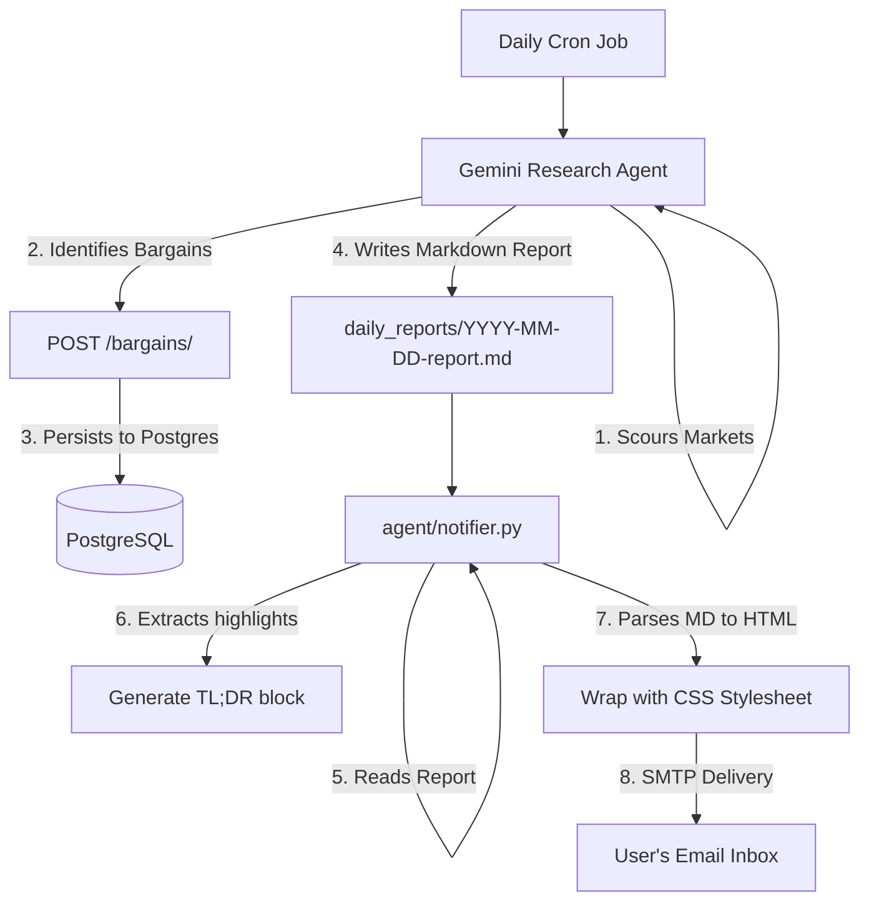

# Specification: Beautiful HTML Emails & Stock Bargain Tracker

This specification outlines the architecture, database schema, API routes, and agent prompt modifications needed to implement highly polished, responsive HTML email notifications and a persistent database system to track Warren Buffett-style stock bargains with custom price intervals over time.

---

## 1. Architectural Overview

The daily research pipeline will be expanded to support both **data persistence** and **beautiful HTML notifications**:



---

## 2. Component Design & Changes

### A. Database Changes (`api/models.py`)
To track bargains and their price intervals over time, we will define a new `Bargain` table in the PostgreSQL database:

```python
# [NEW MODEL] in api/models.py
class Bargain(Base):
    __tablename__ = "bargains"
    
    id = Column(Integer, primary_key=True, index=True)
    ticker = Column(String, index=True, nullable=False)
    name = Column(String, nullable=False)
    industry = Column(String, nullable=False)
    current_price = Column(Numeric(18, 8), nullable=False)
    currency = Column(String, nullable=False, default="USD")
    
    # Valuation Intervals calculated by LLM
    bargain_price = Column(Numeric(18, 8), nullable=False)  # Dynamic Buy Limit (Margin of Safety)
    fair_price = Column(Numeric(18, 8), nullable=False)     # Intrinsic Value
    expensive_price = Column(Numeric(18, 8), nullable=False) # Dynamic Sell Limit
    
    rationale = Column(String, nullable=False)
    timestamp = Column(DateTime, server_default=func.now())
```

---

### B. API Route Changes (`api/main.py`)
We will expose two backend routes to interface with the database.

1. **`POST /bargains/`**: Used by the agent to record a bargain stock with its intervals:
   * **Payload Validation (Pydantic)**:
     ```python
     class BargainCreate(BaseModel):
         ticker: str
         name: str
         industry: str
         current_price: float
         currency: str = "USD"
         bargain_price: float
         fair_price: float
         expensive_price: float
         rationale: str
     ```
2. **`GET /bargains/`**: Used by the portfolio UI dashboard to retrieve the historical list of recommended bargains.

---

### C. Agent Skill Refinements (`agent/skills/buffett_analyst/SKILL.md`)
We will refine the agent guidelines under the **"Peaceful" Bargain Hunting** mandate:

1. **Calculate Custom Price Boundaries**:
   * **Bargain Price**: Dynamic intrinsic value discounted by a calculated Margin of Safety (typically 20% to 30% depending on cash flow consistency).
   * **Fair Price**: Intrinsic value derived from a discounted cash flow (DCF) or Owner Earnings analysis.
   * **Expensive Price**: Sell limit representing a premium of 20% to 30% above intrinsic value.
2. **Persistence Workflow**:
   * Upon completing the daily analysis and compiling the top 3 bargain picks, the agent must invoke the API client (`POST http://api:8000/bargains/`) to persist each stock's pricing boundaries.

---

### D. HTML Email Pipeline (`agent/notifier.py`)
We will rebuild `send_email` inside `agent/notifier.py` using Python's standard `markdown` package:

1. **TL;DR Highlights Extraction**:
   * Parse the generated markdown report to extract high-level narratives and action points to populate a new **⚡ Daily TL;DR Digest** section.
2. **Markdown to HTML parsing**:
   * Translate elements (headings, bullet points, blockquotes, and tables) using `markdown.markdown(text, extensions=['tables'])`.
3. **Responsive CSS Injection**:
   * Wrap the output in a premium email frame featuring:
     * Deep slate headers (`#1e293b`).
     * Curved bordered cards for Bargain Radar picks (`border-radius: 8px`).
     * Color-coded tag alerts (`#10b981` for **BUY/BULLISH**, `#ef4444` for **SELL/BEARISH**, `#d97706` for **HOLD/NEUTRAL**).
4. **Multipart MIME Construction**:
   * Send the email with both a clean plain-text body alternative (for old readers) and the rich HTML body.

---

## 3. Verification Plan

### Automated Endpoint Verification
* We will verify the database migration by compiling/initializing models and testing API calls:
  ```bash
  curl -X POST http://localhost:8000/bargains/ \
    -H "Content-Type: application/json" \
    -d '{"ticker": "TEST", "name": "Test Co", "industry": "Software", "current_price": 100.0, "currency": "USD", "bargain_price": 75.0, "fair_price": 100.0, "expensive_price": 130.0, "rationale": "High switching cost."}'
  ```

### HTML Rendering Verification
* We will run a verification script that reads the mock markdown report, converts it to HTML, and writes the output locally to a file so we can view the HTML layout and CSS styling consistency.

### SMTP Email Dispatch
* Verify SMTP delivery by triggering the notifier script with a test report and validating that the layout looks beautiful in a real email client inbox.
