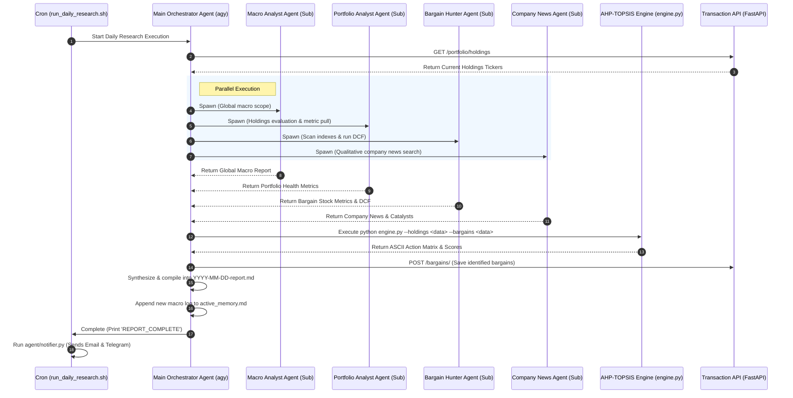

# Design Spec: Multi-Agent Financial Research & AHP-TOPSIS Decision Engine

**Date:** 2026-06-20  
**Status:** Under Review  
**Target Spec Path:** [2026-06-20-multi-agent-research-and-ahp-topsis-design.md](file:///C:/Users/e708399/personal_projects/stock-tracker-gemipi/docs/superpowers/specs/2026-06-20-multi-agent-research-and-ahp-topsis-design.md)

---

## 1. Executive Summary

This design specification transitions the stock tracker research workflow from a broad, single-agent process to a **collaborative multi-agent orchestration system**. Additionally, it introduces a quantitative **AHP-TOPSIS decision engine** (`engine.py`) to systematically rank holdings against watchlist bargains. The final output is rendered in a highly readable, dyslexia-friendly visual layout that isolates stock metric details into compact cards and separates news catalysts.

---

## 2. Current Architecture vs. Proposed Architecture

Currently, a single agent executes all research tasks sequentially. Under the new architecture, a parent orchestrator spawns four parallel functional subagents to specialize.

### Sequence Diagram



---

## 3. Specialized Subagents Specifications

The Orchestrator defines and spawns these four subagents using native platform subagent tools:

1.  **Macro Analyst Agent:**
    *   **Scope:** Central bank policies (Fed, ECB, BoJ), bond yield curves, currencies (USD, EUR, JPY cross rates), geopolitics, supply chains, and commodities.
    *   **Prompt Guideline:** Must structure outputs into concise, high-density bullet points categorized by region.
2.  **Portfolio Analyst Agent:**
    *   **Scope:** Portfolio metrics (ROIC, Debt/Equity, FCF Yield) pulled via internal APIs.
    *   **Prompt Guideline:** Performs "Buffett Moat checks" and compiles holdings status.
3.  **Bargain Hunter Agent:**
    *   **Scope:** Scanning index candidates, applying qualitative moat checks, and computing dynamic DCF boundaries. Excludes defense/munitions.
    *   **Prompt Guideline:** Identifies the top 3-5 undervalued companies.
4.  **Company News Agent:**
    *   **Scope:** Crawls news, earnings releases, and catalysts for current holdings and bargain radar targets.
    *   **Prompt Guideline:** Pulls raw qualitative stories, avoiding numeric metrics (metrics are handled by the portfolio/bargain agents).

---

## 4. AHP-TOPSIS Portfolio Decision Engine (`engine.py`)

A scriptable CLI execution script (`agent/skills/buffett_analyst/scripts/engine.py`) will perform Multi-Criteria Decision Analysis (MCDA) using NumPy and Pandas:

### A. AHP Core Stage
*   **Criteria:** `ROIC` (beneficial), `ROE` (beneficial), `Operating Margin` (beneficial), `PE Ratio` (non-beneficial), and `Debt/Equity` (non-beneficial).
*   **Pairwise Reciprocal Matrix:** Represents Warren Buffett's preferences, prioritizing `ROIC` and `Operating Margin` over `PE Ratio`.
*   **Consistency Check:** Computes the Principal Eigenvalue ($\lambda_{max}$), Consistency Index ($CI = \frac{\lambda_{max} - n}{n - 1}$), and Consistency Ratio ($CR = \frac{CI}{RI}$). Proceed only if $CR < 0.10$.

### B. TOPSIS Vectorization Stage
*   **Decision Matrix:** Merges holdings and watchlisted bargains ($m \times n$).
*   **Normalization:** Vectorized calculation: $r_{ij} = \frac{x_{ij}}{\sqrt{\sum_{k=1}^m x_{kj}^2}}$.
*   **Ideal Solutions:** Evaluates beneficial criteria ($A^+_j = \max(v_{ij})$, $A_j^- = \min(v_{ij})$) and non-beneficial criteria ($A^+_j = \min(v_{ij})$, $A^-_j = \max(v_{ij})$).
*   **Closeness Coefficient ($C_i$):**
    $$S_i^+ = \sqrt{\sum (v_{ij} - A_j^+)^2}, \quad S_i^- = \sqrt{\sum (v_{ij} - A_j^-)^2}$$
    $$C_i = \frac{S_i^-}{S_i^+ + S_i^-}$$

### C. Action Matrix Mapping
*   **STRONG HOLD:** Owned + $C_i \ge 0.70$
*   **STRONG SELL:** Owned + $C_i \le 0.40$
*   **STRONG BUY:** Watchlist + $C_i \ge 0.70$
*   **IGNORE:** Watchlist + $C_i < 0.70$ or Owned + $0.40 < C_i < 0.70$ (mapped as standard `HOLD`).

---

## 5. Spacious, Dyslexia-Friendly Layout (Option B + C)

### General Formatting Constraints
*   **Left-Aligned Text:** Standardized left alignment throughout the email. No justified text.
*   **Generous Margins & Line Height:** Line height set to `1.8`, with large gaps between sections.
*   **Separate News & Catalysts (Option C):** Quantitative cards are presented first, with qualitative news grouped together at the bottom.

### Stock Card Layout (`max-width: 360px`)
```html
<div style="background: #ffffff; border: 1px solid #e2e8f0; border-left: 5px solid #10b981; border-radius: 8px; padding: 18px 22px; margin-bottom: 24px; max-width: 360px; box-shadow: 0 4px 6px -1px rgba(0,0,0,0.05);">
  <div style="display: flex; justify-content: space-between; align-items: center; margin-bottom: 12px;">
    <div>
      <h3 style="margin: 0; font-size: 1.15rem; font-weight: 800; color: #0f172a; letter-spacing: -0.02em;">KO</h3>
      <span style="font-size: 0.75rem; color: #64748b; font-weight: 500;">Coca-Cola Co.</span>
    </div>
    <span style="background: #ecfdf5; color: #059669; padding: 4px 10px; border-radius: 100px; font-size: 0.72rem; font-weight: 800; letter-spacing: 0.05em; text-transform: uppercase;">STRONG BUY</span>
  </div>
  
  <table style="width: 100%; border-collapse: collapse; font-size: 0.85rem; line-height: 1.4;">
    <tr>
      <td style="padding: 5px 0; border-bottom: 1px dashed #f1f5f9; color: #64748b;">ROIC</td>
      <td style="padding: 5px 0; border-bottom: 1px dashed #f1f5f9; text-align: right; font-weight: 700; color: #0f172a;">19.2%</td>
    </tr>
    <tr>
      <td style="padding: 5px 0; border-bottom: 1px dashed #f1f5f9; color: #64748b;">Debt/Equity</td>
      <td style="padding: 5px 0; border-bottom: 1px dashed #f1f5f9; text-align: right; font-weight: 700; color: #0f172a;">0.92</td>
    </tr>
    <tr>
      <td style="padding: 5px 0; border-bottom: 1px dashed #f1f5f9; color: #64748b;">FCF Yield</td>
      <td style="padding: 5px 0; border-bottom: 1px dashed #f1f5f9; text-align: right; font-weight: 700; color: #0f172a;">6.5%</td>
    </tr>
    <tr>
      <td style="padding: 5px 0; color: #64748b;">Valuation</td>
      <td style="padding: 5px 0; text-align: right; font-weight: 700; color: #059669;">Bargain (<$58)</td>
    </tr>
  </table>
</div>
```

---

## 6. Verification and Test Plan

1.  **AHP-TOPSIS Tests:**
    *   Implement unit tests verify pairwise matrix calculations, check CR validation logic, and verify ideal vector distances logic.
2.  **Orchestration Simulation:**
    *   Verify the orchestrator successfully defines and invokes all 4 subagents and captures their payloads asynchronously.
3.  **Layout Render Inspection:**
    *   Output the styled HTML report to a temporary local file and verify layout constraints, typography heights, and card widths are maintained.
